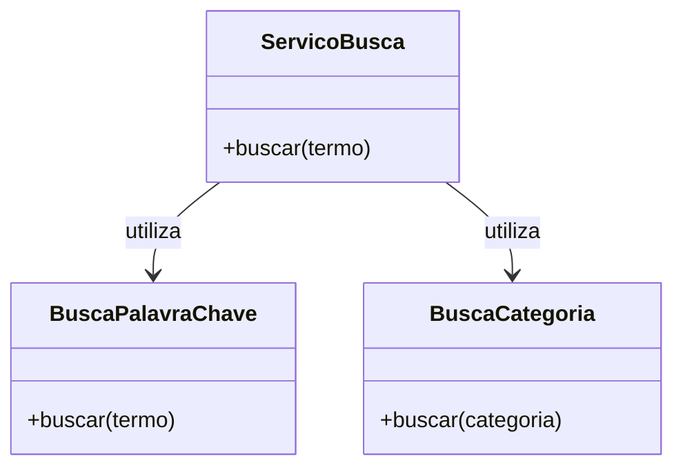
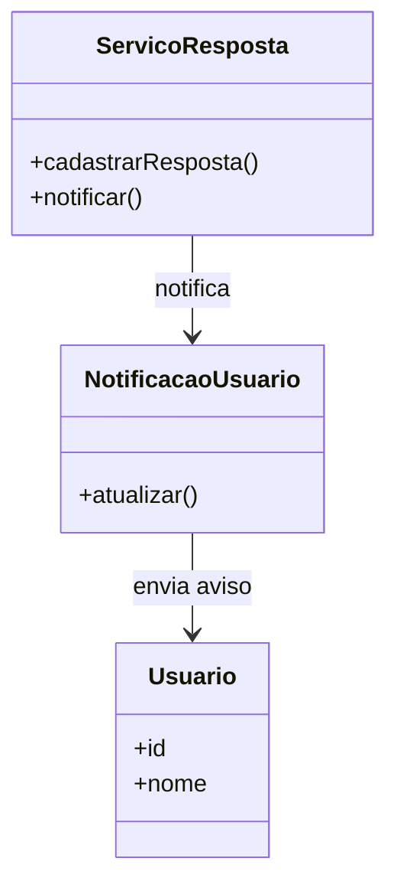
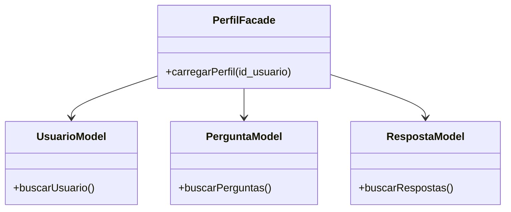

O padrão Strategy poderia ser aplicado na busca de perguntas. A ideia seria separar cada forma de pesquisa em uma estratégia diferente, como busca por palavra-chave ou por categoria. Isso evita concentrar todas as formas de busca em uma única função e facilita adicionar novas opções depois.

Os módulos BuscaPalavraChave e BuscaCategoria teriam a mesma função de buscar perguntas, enquanto o ServicoBusca utilizaria a estratégia escolhida pelo usuário.



Exemplo de código:

```javascript
function buscar(termo, estrategia) {
  return estrategia(termo);
}

function buscarPorPalavra(termo) {
  return modelo.buscar_perguntas(termo);
}

function buscarPorCategoria(categoria) {
  return modelo.buscar_por_categoria(categoria);
}
```

Além disso, o padrão Observer poderia ser utilizado na funcionalidade de notificações. Quando uma nova resposta fosse cadastrada, o sistema avisaria o usuário responsável pela pergunta. Assim, o cadastro da resposta não precisaria cuidar diretamente de toda a lógica da notificação.

O módulo responsável pelas respostas notificaria os observadores cadastrados sempre que houvesse uma nova resposta.



Exemplo de código:

```javascript
function cadastrarResposta(resposta) {
  modelo.cadastrar_resposta(resposta);

  notificarUsuario(resposta.id_pergunta);
}

function notificarUsuario(id_pergunta) {
  console.log("Nova resposta cadastrada");
}
```

Já o padrão Facade poderia ser aplicado ao perfil do usuário. Para montar o perfil, o sistema precisaria consultar dados do usuário, suas perguntas e suas respostas. O PerfilFacade serviria como um ponto único para reunir essas informações, evitando que o frontend precise acessar vários módulos diferentes.



Exemplo de código:

```javascript
function carregarPerfil(id_usuario) {
  const usuario = buscarUsuario(id_usuario);
  const perguntas = buscarPerguntasUsuario(id_usuario);
  const respostas = buscarRespostasUsuario(id_usuario);

  return {
    usuario: usuario,
    perguntas: perguntas,
    respostas: respostas
  };
}
```
