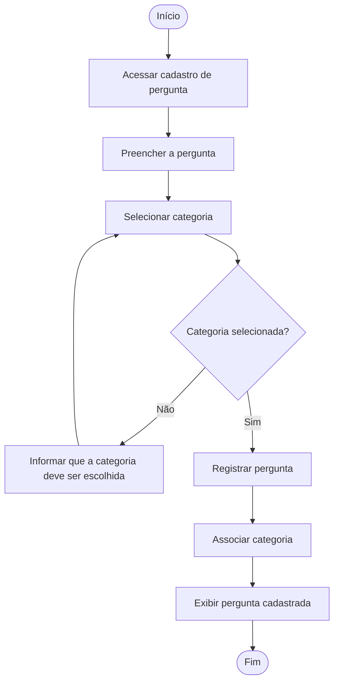

c) Diagrama de Atividades

```mermaid
flowchart TD
    A([Início]) --> B[Acessar cadastro de pergunta]
    B --> C[Preencher a pergunta]
    C --> D[Selecionar categoria]
    D --> E{Categoria selecionada?}

    E -- Não --> F[Informar que a categoria deve ser escolhida]
    F --> D

    E -- Sim --> G[Registrar pergunta]
    G --> H[Associar categoria]
    H --> I[Exibir pergunta cadastrada]
    I --> J([Fim])
```
