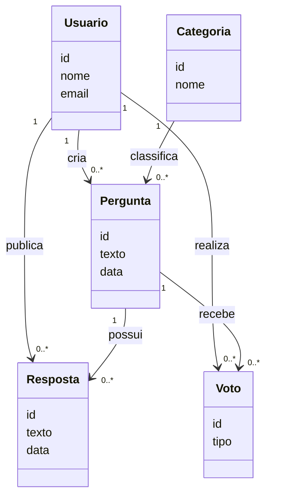

a) Diagrama de Classes

```mermaid
classDiagram
    class Usuario {
        id
        nome
        email
    }

    class Pergunta {
        id
        texto
        data
    }

    class Resposta {
        id
        texto
        data
    }

    class Categoria {
        id
        nome
    }

    class Voto {
        id
        tipo
    }

    Usuario "1" --> "0..*" Pergunta : cria
    Usuario "1" --> "0..*" Resposta : publica
    Pergunta "1" --> "0..*" Resposta : possui
    Categoria "1" --> "0..*" Pergunta : classifica
    Usuario "1" --> "0..*" Voto : realiza
    Pergunta "1" --> "0..*" Voto : recebe
```
