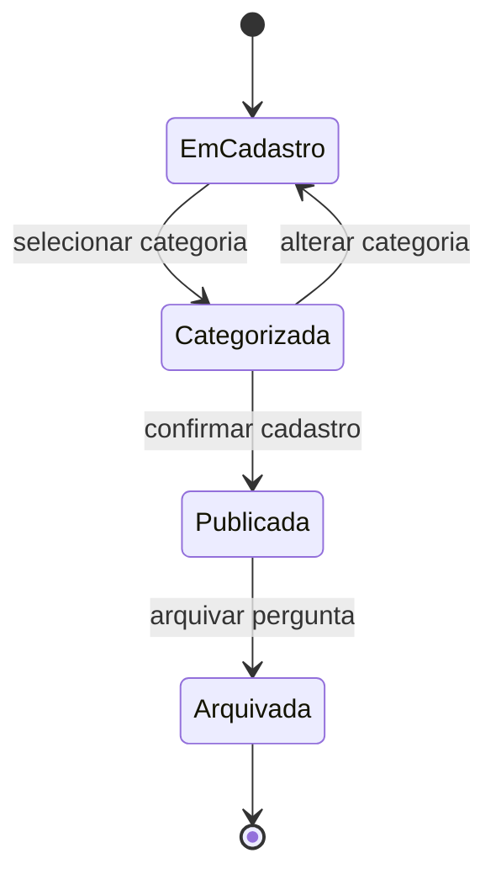

d) Diagrama de Estados

```mermaid
stateDiagram-v2
    [*] --> EmCadastro

    EmCadastro --> Categorizada : selecionar categoria
    Categorizada --> Publicada : confirmar cadastro
    Categorizada --> EmCadastro : alterar categoria
    Publicada --> Arquivada : arquivar pergunta

    Arquivada --> [*]
```
