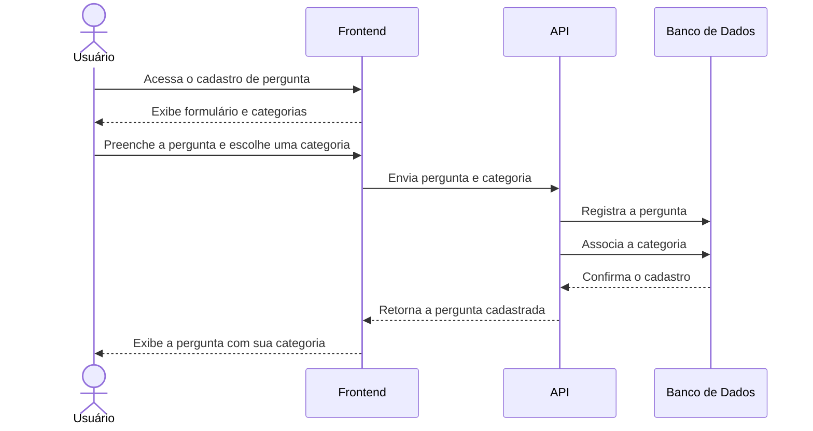

b) Diagrama de Sequência

```mermaid
sequenceDiagram
    actor U as Usuário
    participant F as Frontend
    participant A as API
    participant B as Banco de Dados

    U->>F: Acessa o cadastro de pergunta
    F-->>U: Exibe formulário e categorias

    U->>F: Preenche a pergunta e escolhe uma categoria
    F->>A: Envia pergunta e categoria

    A->>B: Registra a pergunta
    A->>B: Associa a categoria

    B-->>A: Confirma o cadastro
    A-->>F: Retorna a pergunta cadastrada
    F-->>U: Exibe a pergunta com sua categoria
```
